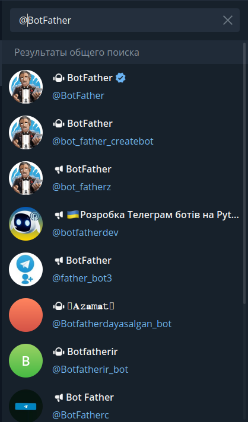

# Telegram Bot (1-dars)

<!-- ---------- -->

## Ushbu maqolamizda siz bilan quyidagilarni ko'rib chiqamiz:

- Telegram Bot nima?
- Qanday qilib telegram bot ochish mumkin?
- Botni sozlash

<!-- ## **Telegram Bot nima?** -->

## **Qanday qilib telegram bot ochish mumkin?**
1. Dastlab [@BotFather](https://t.me/BotFather)'ni telegramdagi qidiruv qismidan qidirib olamiz.

> Rasmdagi kabi rasmiy belgisi bor bot haqiqiy [@BotFather](https://t.me/BotFather) hisoblanadi.
![1-dars]
2. Botga kirganingizdan so'ng "Запустить" (Boshlash,Start) tugmasini bosing.
> Bunga javoban bot sizga botdagi mavjud buyruqlarni yuboradi.
3. "`/newbot`" buyrug'ini yuboring.
4. O'chmoqchi bo'lgan botingizni nomini kiriting;
5. O'chmoqchi bo'lgan botingizning username'ni kiriting;
> Bot username'mining oxiri bot so'zi bilan tugashi shart!
6. Bot muvvaffaqiyatli ochilgan bo'lsa BotFather sizga botingiz tokenini yuboradi,aks xolda siz kiritgan username band bo'lganligi uchun,boshqa username kiritishingizni so'raydi.
